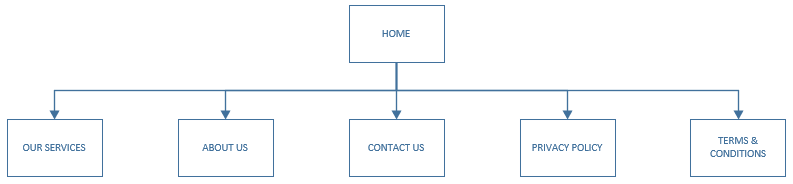
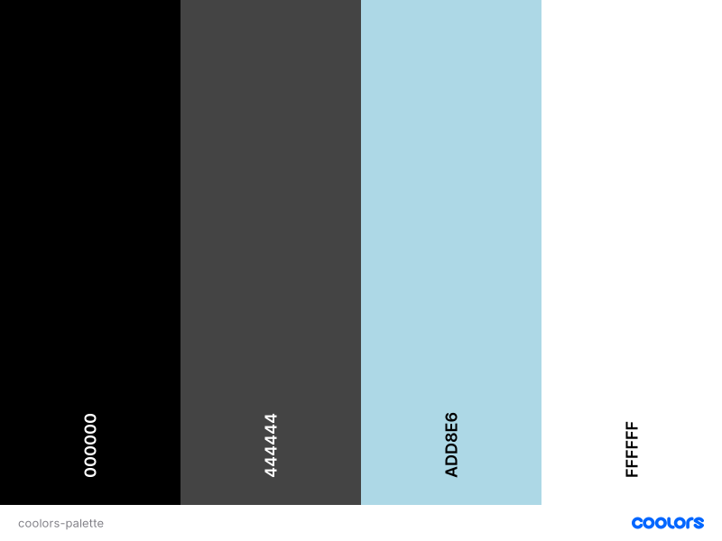
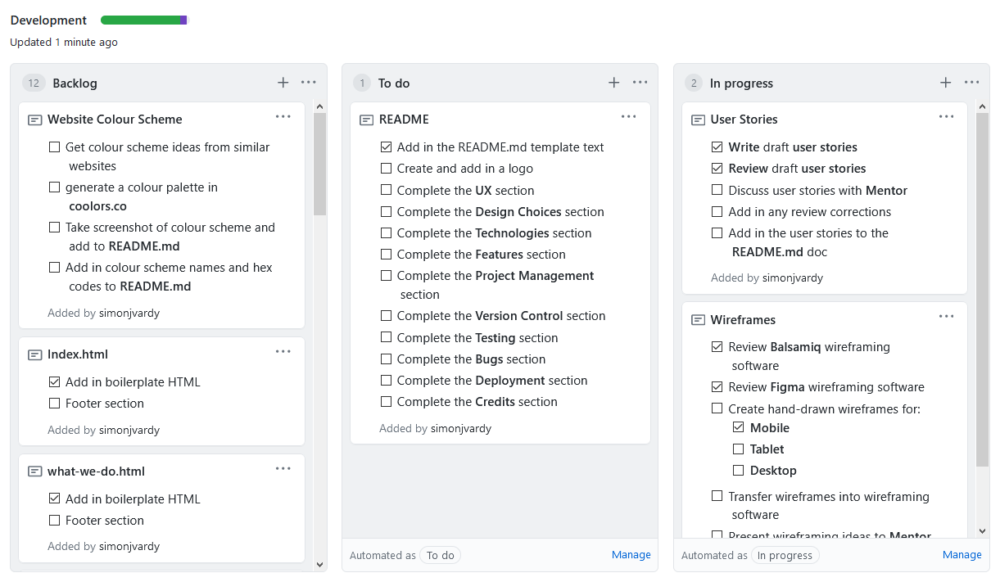

#  #

***Aviation Consultancy LLC** is (fictitious) consultancy business specialising in aircraft maintenance data and regulatory compliance, based at 
London Heathrow Airport.
I designed the website to be a showcase of the available services and a means for new customers to make contact with the business allowing project and service requests to be submitted. 
It's services are B2B so not required to sell any products directly via the site.*

 

*I created the Aviation Consultancy LLC logo to present a professional, trustworthy image based on research of similar contemporary consultancy service websites 
(details of these websites can be found in the Credits section). The colour scheme was chosen from the Blue / Green colours to reflect a calm balanced approach as well as to 
blend well with the aviation and sky themes.*

## Contents ##

- [!Aviation Consultancy](#img-srcassetsimageslogo-imagejpg-altaviation-consultancy)
  - [Contents](#contents)
  - [UX (User Experience)](#ux-user-experience)
    - [Project Goals](#project-goals)
    - [User Goals](#user-goals)
    - [User Stories](#user-stories)
    - [Site Owner Goals](#site-owner-goals)
  - [Design Choices](#design-choices)
    - [Topology](#topology)
    - [Fonts](#fonts)
    - [Colours](#colours)
    - [Wireframes](#wireframes)
      - [Hand drawn drafts](#hand-drawn-drafts)
      - [Final Wireframes](#final-wireframes)
  - [Technologies](#technologies)
    - [Languages](#languages)
    - [Libraries](#libraries)
    - [Tools](#tools)
  - [Features](#features)
    - [Features Implemented](#features-implemented)
    - [Future Features](#future-features)
  - [SEO](#seo)
      - [HTML Sitemap links](#html-sitemap-links)
      - [XML Sitemap file](#xml-sitemap-file)
      - [Google Search Console](#google-search-console)
  - [Version Control](#version-control)
      - [Gitpod Workspaces](#gitpod-workspaces)
      - [Branches](#branches)
      - [Working within a branch](#working-within-a-branch)
      - [Merging branches in GitHub](#merging-branches-in-github)
      - [Update Gitpod with the latest GitHub commits](#update-gitpod-with-the-latest-github-commits)
  - [Project Management](#project-management)
  - [Testing](#testing)
  - [Bugs](#bugs)
  - [Deployment](#deployment)
    - [Running Aviation-Consultancy Locally](#running-aviation-consultancy-locally)
  - [Credits](#credits)
    - [Images](#images)
    - [Colour](#colour)
    - [Image editing](#image-editing)
    - [Inspiration](#inspiration)
    - [Acknowledgements](#acknowledgements)
  - [- Embeds example code was copied and adapted for the Google Maps embedded iframe](#ulliembeds-example-code-was-copied-and-adapted-for-the-google-maps-embedded-iframeliul)

---

## UX (User Experience) ##

### Project Goals ###

The **goal** of this project is to build a website which allows Aviation Consultancy LLC to showcase its B2B services to potential business customers.

The features on the website will:

- Give business customers more ways to interact with Aviation Consultancy LLC (contact form, social media, phone,  email).
- Enable the business to showcase their services and key staff members.

I achieve this by:

- Providing contact details and social media links in the footer section of each page.
- Providing an option to the customers to submit their contact and request details in a form.
- Providing a summary of the consultancy services provided by Aviation Consultancy LLC
- Providing an option to the customers to see staff member biographies and links to social media to findo out more.

### User Goals ###

- **Understand** whether the provided services solve their problems or pain points.
- **Contact** the business to submit a project proposal.

### User Stories ###

- As a **user**, I want to see a **navigation bar** at the top of the page where I can navigate to each of the different site pages.
- As a **user**, I can see a **collapsed navigation bar icon** on mobile devices that opens up to give access to the site navigation links when clicked.
- As a **user**, I can see a **company logo** or name in the navigation bar.
- As a **user**, I can see a **hero image** welcoming the user to the site.
- As a **user**, I can see **Call To Actions (CTA)** to learn more about the business and to make contact with the business.
- As a **user**, I can see a carousel containing **customer testimonials** or **inspirational quotes**.
- As a **user**, I can scroll back to the top of a page with the **click of a button**.
- As a **user**, I can see a page describing the **services** provided by the business.
- As a **user**, I can see a page describing the **company values**.
- As a **user**, I can read a **biography** of **key personnel** in the company.
- As a **user**, I can **contact** the business by submitting my details with a message.
- As a **user**, I want to know where the business is **located on a map**.
- As a **user**, I can see the website **privacy policy** and **terms and conditions**.
- As a **user**, I can see a **site map** with **links** to all the site pages.
- As a **user**, I can contact the business using their **social media** channels, **call** them or **email**.

### Site Owner Goals ###

- As a **site owner**, I want to create an **interactive website** allowing the user to easily understand the services available
- As a **site owner**, I want the **user** to be able to see a **location** of the business on the google maps.
- As a **site owner**, I want the **user** to be able to **submit** a **contact request** with **additional text**. 
- As a **site owner**, I want the **user** to see the **unique selling points** of the business
- As a **site owner**, I want the **user** to be able to understand the **company values**.
- As a **site owner**, I want the **user** to be able to the understand the **purpose** of the business.

--- 

## Design Choices ##

### Topology ###



### Fonts ###

I have chosen [Oswald](https://fonts.google.com/specimen/Oswald?query=Oswald) for all of the headers and [Roboto](https://fonts.google.com/specimen/Roboto?query=Roboto) the rest of the text.

### Colours ###

I have chosen the colours that say 'trust' and 'dependable' buy using light blue, white and black to compliment the aviation theme. The images used in the site display a range of blue tones and so the palette choice also compliments the design of the project.


- *Black* (000000) - Black
- *Onyx* (444444) - Dark Grey
- *Light Blue* (ADD8E6) - Sky blue
- *White* (FFFFFF) - White

These colours will compliment each other well when used across the site creating a pleasant ambience.

### Wireframes ###

I designed the site mock-ups originally using pen and paper and then developing the designs further using [Balsamiq wireframes](https://balsamiq.com/).

I'm focusing on defining the basic layout structure of the site and identifying how displays would change on different screen sizes such as mobile, tablet and desktop for each page.

#### Hand drawn drafts ####

The original hand drawn sketch wireframes were created as quick and rough method to try out page formatting ideas to form a basis for creating the wireframe within balsamic.

They represent the early stages of the design process for the website as ideas started to form and the flow of the design process from idea to finished website.
- [Homepage](wireframes/original-drafts/wireframe-mobile-homepage-draft.jpg)
- [Our Services](wireframes/original-drafts/wireframe-mobile-our-services-draft.jpg)
- [What We Do](wireframes/original-drafts/wireframe-mobile-what-we-do-draft.jpg)
- [About Us](wireframes/original-drafts/wireframe-mobile-about-us-draft.jpg)
- [Contact Us](wireframes/original-drafts/wireframe-mobile-contact-us-draft.jpg)
- [Terms & Conditions / Privacy Policy](wireframes/original-drafts/wireframe-mobile-tc-privacy-draft.jpg)

#### Final Wireframes ####

The final wireframes were created using Balsamiq adapted from the original hand drawn wireframe concepts. Each impage shows a page from the site in three display sizes to demonstrate
the page design and layout.

- [Homepage](wireframes/home-page.png)
- [Our Services](wireframes/our-services.png)
- [About Us](wireframes/about-us.png)
- [Contact Us](wireframes/contact-us.png)
- [Contact Form Modal](wireframes/contact-form.png)
- [Terms & Conditions](wireframes/terms-and-conditions.png)
- [Privacy Policy](wireframes/privacy-policy.png)

---  

## Technologies ##

### Languages ###

- [HTML5](https://developer.mozilla.org/en-US/docs/Web/HTML)
  - Used as the main markup language for the website content.
- [CSS3](https://developer.mozilla.org/en-US/docs/Web/CSS)
  - Used to style the individual webpages.

### Libraries ###

- [Bootstrap](https://getbootstrap.com/)
  - Used to design a mobile-first responsive website layout.
- [jQuery](https://jquery.com/)
  - Loaded as part of the [Bootstrap CDN starter template](https://getbootstrap.com/docs/4.5/getting-started/introduction/#starter-template)
- [Popper](https://popper.js.org/)
  - Loaded as part of the [Bootstrap CDN starter template](https://getbootstrap.com/docs/4.5/getting-started/introduction/#starter-template)

  
### Tools ###

- [Git](https://git-scm.com/)
  - Git was used for version control by utilising the Gitpod terminal to commit to Git and push to GitHub.
- [GitHub](https://github.com/)
  - Used to store, host and deploy the project files and source code after being pushed from Git.
- [Gitpod](https://www.gitpod.io/)
  - An online IDE linked to the GitHub repository used for the majority of the code development.
- [CodePen](https://codepen.io/simonjvardy/)
  - An online code editor and open-source learning environment used to test small sections of code quickly and easily.
- [Visual Studio Code](https://code.visualstudio.com/)
  - A locally installed IDE connected to the GitHub repository for when there was no internet connection to use Gitpod.
- [Font-Awesome](https://fontawesome.com/icons?d=gallery)
  - Used for icons to enhance headings and add emphasis to text.
- [Google fonts](https://fonts.google.com/)
  - Used for the website fonts.
- [Coolors](https://coolors.co/)
  - An online tool used to choose the website colour scheme.
- [Birme](https://www.birme.net/)
  - An online bulk image resizing tool.
- [Favicons](https://favicon.io/)
  - Used to generate a favicon for the website title.
- [Am I Responsive?](http://ami.responsivedesign.is/)
  - A tool for taking a quick snapshot of the responsive breakpoints of the website to visualise how the site will look on different device screen sizes in one place. The resulting screenshot is also used as the README.md logo image.
- [Microsoft Visio](https://www.microsoft.com/en-gb/microsoft-365/visio/flowchart-software)
  - A software tool for drawing diagrams and flowcharts which is part of the Microsoft Office365 suite used to create the website topology chart.
- [XML-Sitemaps.com](https://www.xml-sitemaps.com/)
  - An online .xml sitemap generator.
- [What is my Screen Resolution](http://whatismyscreenresolution.net/)
  - An online tool to find out the screen resolution on your device used for CSS @media queries
- [Random Name Generator](https://www.name-generator.org.uk/)
  - An online tool to generate random names for the team members in the About Us page.
- [Microsoft Office365](https://www.microsoft.com/en-gb/microsoft-365)
  - A suite of productivity apps used to design the Aviation Consultancy LLC logo

---

## Features ##

### Features Implemented ###

- Responsive mobile first design using a [Bootstrap](https://getbootstrap.com/) framework.
- User friendly display
- A Navbar with easy navigation that collapses on mobile displays
- CTAs to encourage customers to make contact
- A Contact Us pop-up modal with a form to submit user details and a request
- Contact Us page with an embedded Google Maps to show the business location
- Social media links
- Bootstrap accordions to assist with readability of large amounts of text on mobile displays
- Sitemap features for SEO enhancement
  
### Future Features ###

- Blog / news page
- Case studies page
- How We Work page

---

## SEO ##

Search Engine Optimisation for the site was provided in three complementary ways:
 - HTML Sitemap links
 - XML sitemap file saved in the root directory
 - Google Search Console
 
#### HTML Sitemap links ####
- **Secondary** HTML links to each page in the website were added to the footer section of each site page to allow users an alternative means of navigating the site easily.

#### XML Sitemap file ####
- A sitemap.xml file was created to help search engines find, crawl and index the website more easily. It was created by using XML-Sitemaps.com and entering the URL for the deployed website and letting it automatically generate the required xml data for the whole site.
The file was then saved in the GitHub repository root directory.

- The following steps were used to generate the sitemap.xml file:

#### Google Search Console ####
- Google Search Console was used to assist with testing and indexing issues with the website and to see how the site performs in Google search results.

- The following steps were used to perform the indexing tests:

Even though this website has a small number of pages and have navigation links on each page making the Sitemap largely unnecessary, I felt is was a good experience and good practice to add these features in.
Note: I haven't added a robots.txt file yet but may add this in the future when I understand more about search engine optimisation techniques.

---

## Version Control ##
**Version control** for this repository is managed within **GitHub** and **Gitpod** using separate [branches](https://github.com/simonjvardy/Aviation-Consultancy/branches)  used to work on specific aspects of the project.
The following describes the repository branch structure:
- **Master** - this is the default branch and the source for the repository deployment.
    - **Documentation** - this branch is used for updating the README.md and testing.md documentation only.
    - **Development** - this branch is used as the main working branch for the website development
    - Each individual **bug fixes** are raised within their own **separate branches** using the naming convention **\<GitHub Issue ID Number>-\<bug fix description>** e.g. branch name ***12-correct-navbar-links*** 

The following workflow steps are used to create and update branches within Gitpod and to push changes back to GitHub.

#### Gitpod Workspaces ####
1. Open **Gitpod** from **Github** using the Gitpod button. This needs to only be done **once** at the start of the project.
2. Start the Gitpod Workspace which opens an **online IDE editor** window.

#### Branches ####
3. For changes to be made to any **documentation files**, the git command `git checkout documentation` is used to checkout and switch to the **documentation branch**.
4. For changes to be made to **all other files**, the git command `git checkout development` is used to checkout and switch to the **development branch**.
5. To create a **new branch**, use the git command `git checkout -b <branch-name>` to **create and switch** to the new branch.

#### Working within a branch ####
6. **New** or **modified** files are **staged** using the `git add .` command
7. The changes are **committed** using `git commit -m "<commit message>"` command.
8. If the changes are in a newly created branch, the **committed** changes are **pushed** from Gitpod to GitHub using the `git push --set-upstream origin <branch-name>` command as there is currently no upstream branch in the remote repository.
9. For branches that have already been synchronised, the **committed** changes are **pushed** from Gitpod to GitHub using the `git push` command.

#### Merging branches in GitHub ####
10. Opening the repository in Github, a new **pull request** is created for the updated branch and assigned to the **Development project**.
11. The changes are **reviewed** to ensure there are **no conflicts** between the **updated branch** and the **Master branch**.
12. The changes are then **merged** into the **Master branch** and the merge request is **closed**. The **Project entry** is **automatically** moved to the **Done** card.

#### Update Gitpod with the latest GitHub commits ####
13. To update Gitpod with the **latest commits** From GitHub, the `git checkout master` command is used to checkout and switch to the master branch.
14. Use the `git pull` command to update the master branch and **reset the pointer**.
15. Now **switch** to the **other branches** in Gitpod using the `git checkout <branch-name>` command and use the `git merge origin/master` command to **update each branch in turn**.
16. Use the `git push` on **each branch** to update the relevant GiHub Branches to the **same commit** as the **Master branch**.
17. **Repeat steps 3 - 17 regularly** to ensure updates are **saved** and **correctly version controlled** in GitHub.

---

## Project Management ##

GitHub [Projects](https://github.com/simonjvardy/Aviation-Consultancy/projects) are used to organise the planning and development of the website using the Automated kanban template.
The following project cards are used to manage the tasks:
- **Backlog** - this card is used to capture ideas for project tasks.
- **To Do** - this is the current work queue for the project.
- **In Progress** - this is the list of tasks currently in work.
    - New issues and pull requests are automatically added to this column using project card automation options.
- **Review in progress** - Pull requests are automatically moved here by project automation options when the reviewer requests any changes to be carried out.
    - As there is only one contributor on this project currently, most pull requests bypass this card as the request is usually reviewed and merged in the same step.
- **Reviewer approved** - Pull requests are automatically moved here by project automation options when they meet the minimum number of required reviews.
    - As there is only one contributor currently, most pull requests bypass this card as the request is usually reviewed and merged in the same step.
- **Testing** - Testing tasks list
- **Done** - completed tasks

Markdown syntax is used to create checkboxes by adding `- [ ]` and `- [x]` text which creates a **"to do" list** on cards as a way of spliting a single complex task into a list of steps to be completed.



---
## Testing ##

- Testing information can be found in a separate [testing.md](testing.md) file.

---
## Bugs ##

To manage bugs and issues tracking, the default GitHub [bug_report.md template](https://github.com/simonjvardy/MS-1/blob/master/.github/ISSUE_TEMPLATE/bug_report.md) has been created and activated within the repository settings Features > Issues section.
All new bugs and issues are tracked within the GitHub repository [Issues section](https://github.com/simonjvardy/Aviation-Consultancy/issues) .
Open issues are managed within the [GitHub Projects section](https://github.com/simonjvardy/Aviation-Consultancy/projects)

Each branch is then **merged** into the **master branch** using a **pull request** that is **linked** to the **open issue**. Once merged, and the bug report **closed**, the branch is **deleted**.

Fixed bugs and issues are marked as [closed](https://github.com/simonjvardy/Aviation-Consultancy/issues?q=is%3Aissue+is%3Aclosed).

---

## Deployment ##

The website was developed using both *Gitpod* and *Visual Studio Code* and using *Git* pushed to *GitHub*, which hosts the repository. I made the following steps to deploy the site using *GitHub Pages*:

- Opened up **GitHub** in the browser.
- Signed in with my **username** and **password**.
- Selected my **repositories**.
- Navigated to **simonjvardy/Aviation-Consultancy**.
- In the top navigation clicked **settings**.
- Scrolled down to the **GitHub Pages** area.
- Selected **Master Branch** from the **Source** dropdown menu.
- Clicked to **confirm** my **selection**.
- [Aviation-Consultancy](https://simonjvardy.github.io/Aviation-Consultancy/) is now **live** on **GitHub Pages**.

### Running Aviation-Consultancy Locally ###

Cloning Aviation-Consultancy from GitHub:

- Navigate to **simonjvardy/Aviation-Consultancy**.
- Click the green **Code** button.
- **Copy** the url in the dropdown box.
- Using your favourite **IDE** open up your preferred terminal.
- **Navigate** to your desired file location.

Copy the following code and input it into your terminal to clone Aviation-Consultancy:

```git clone https://github.com/simonjvardy/Aviation-Consultancy.git```

---

## Credits ##

### Images ###

You can find the images used for the site [here](assets/images). I have sourced them through various websites, which are either free to use or used under license:

- Homepage
  - The [Callout Hero Image](assets/images/aircraft-hangar-lg.jpg) was sourced and used under license from Shutterstock.com
  - The card deck image caps:
    - [Our Services](assets/images/engine-fanblades.jpg) image was sourced and used under license from Shutterstock.com
    - [About Us](assets/images/aircraft-hangar-front.jpg) image is used courtesy of [Jetstar Airways sourced from Flickr.com](https://www.flickr.com/photos/jetstarairways/6768081235)
    - [TBC](assets/images/aircraft-terminal-dusk.jpg) image was sourced as a free to use image from [Pikrepo.com](https://www.pikrepo.com/fbxpn/white-and-blue-airplane-under-blue-sky-during-daytime)
  - The Testimonials carousel [background image](assets/images/above-the-clouds.jpg) was used with kind permission by Arun Kulshreshtha - Own work, CC BY 3.0 us, https://commons.wikimedia.org/w/index.php?curid=1902748

- Our Services
  - The [Hero Image](assets/images/aircraft-engine.jpg) was sourced as a free to use image from [Pexels.com](https://www.pexels.com/photo/airplane-engine-459402/)
  - The card deck image caps:
    - [Data Analysis](assets/images/man-touch-finger-digital-change-data.jpg) image was sourced as a free to use image from [Pikist.com](https://www.pikist.com/free-photo-swtdf)
    - [Data Migration](assets/images/man-touch-finger-data-network.jpg) image was sourced as a free to use image from [Pikist.com](https://www.pikist.com/free-photo-sshpj)
    - [Data Integrity](assets/images/man-touch-finger-data-connection.jpg) image was sourced as a free to use image from [Pikist.com](https://www.pikist.com/free-photo-vddfz)
  - The Testimonials carousel [background image](assets/images/above-the-clouds.jpg) was used with kind permission by Arun Kulshreshtha - Own work, CC BY 3.0 us, https://commons.wikimedia.org/w/index.php?curid=1902748

- About Us
  - The [Hero Image](assets/images/aircraft-hangar-front-web.jpg)  image is used courtesy of [Jetstar Airways sourced from Flickr.com](https://www.flickr.com/photos/jetstarairways/6768081235)
  - The card deck image caps:
    - [Expertise](assets/images/departure-board.jpg) image was sourced as a free to use image from [Pikrepo.com](https://www.pikrepo.com/favaw/airplane-flight-schedules)
    - [Integrity](assets/images/escalator.jpg) image was sourced as a free to use image from [Pxfuel.com](https://www.pxfuel.com/en/free-photo-xppcq)
    - [Innovation](assets/images/travelator.jpg) image was sourced as a free to use image from [pixabay.com](https://pixabay.com/photos/travelator-walkway-travel-airport-1209281/)
  - The fictitious Meet The Team portrait images:
    - ['Thomas Brooks'](assets/images/portrait-man-1.jpg) was sourced and used under license from Shutterstock.com
    - ['Dr. Mary Hoffman'](assets/images/portrait-woman-1.jpg) was sourced and used under license from Shutterstock.com
    -  ['Elizabeth Ward'](assets/images/portrait-woman-2.jpg) was sourced and used under license from Shutterstock.com
    - ['Michael Lawson'](assets/images/portrait-man-2.jpg) was sourced and used under license from Shutterstock.com
  - The Testimonials carousel [background image](assets/images/above-the-clouds.jpg) was used with kind permission by Arun Kulshreshtha - Own work, CC BY 3.0 us, https://commons.wikimedia.org/w/index.php?curid=1902748

- Contact Us
  - The [Hero Image](assets/images/aircraft-hangar-front-web.jpg) image was sourced as a free to use image from [ Pikrepo.com](https://www.pikrepo.com/fiyrd/low-light-photographed-of-gray-plane-on-pathway)
  - The Testimonials carousel [background image](assets/images/above-the-clouds.jpg) was used with kind permission by Arun Kulshreshtha - Own work, CC BY 3.0 us, https://commons.wikimedia.org/w/index.php?curid=1902748

### Colour ###

The colour palette was identified on [Coolors](https://coolors.co/)

### Image editing ###

- Microsoft snipping tool was used for capturing screengrabs which are saved as images.
- A handy [Birme](https://www.birme.net/?target_width=300&target_height=300&quality=100&border_width=1&border_color=%23bd3d3a) site allowed me to resize the images all at once.

### Inspiration ###

The following websites were used for design and image ideas based on similar business sectors:
- [Osprey Consulting Services](https://ospreycsl.co.uk/)
- [IAG The Internatioanl Aviation Group](https://theaviationgroup.eu/mro/)
- [Aviation Analysts International](http://www.inter-aviation.com/)
- [Aviation Consulting Services](https://aviationconsultingservices.com.au/)
- [ICF](https://www.icf.com/)
- [Alton Aviation Consultants](https://altonaviation.com/)
- [VJL Consulting Ltd](https://vjlconsult.com)

The following website was used for design ideas and a clean modern look:
- [Greenhouse Digital Marketing Agency](https://pages.ghagency.com/)

### Acknowledgements ###

- [W3Schools](https://www.w3schools.com/) for just being a constant source of help and inspiration!
- [Code Institute](https://codeinstitute.net/full-stack-software-development-diploma/) Course material for the inspiration from code-along challenges.
- [San Francisco State Univerity](https://its.sfsu.edu/projects/resources) PMO Resources webpage where the original Unit Testing and UAT Testing Plan documents were sourced
- [usersnap.com blog](https://usersnap.com/blog/user-acceptance-testing-example/) which was the inspiration for the modified UAT Testing document and wording.
- [Neringa Bickmore](https://github.com/neringabickmore) for her guidance and advice on the README.md and testing.md document content and layout.
- [Frozenaught](https://github.com/Frozenaught/homechopped) for further README.md content ideas.
- [Gary Simons](https://github.com/GarySimons/WildBunch-Florist) for further README.md content ideas.
- [Software Testing Fundamentals (STF)](http://softwaretestingfundamentals.com/) for an excellent guide on building testing processes.
- [CoSchedule Blog Post](https://coschedule.com/blog/color-psychology-marketing/) for help with colour psychology in marketing.
- [Git - Branching and Merging](https://git-scm.com/book/en/v2/Git-Branching-Basic-Branching-and-Merging) documentation for help understanding how to manage branches in GitHub / Gitpod.
- [Stack Overflow](https://stackoverflow.com/questions/273695/what-are-some-examples-of-commonly-used-practices-for-naming-git-branches) for ideas and help with GitHub branch naming conventions.
- [digitaljhelms](https://gist.github.com/digitaljhelms/4287848) for ideas and help with GitHub branch naming conventions.
- [Code Institute July 2020 Hackathon BI Team 5](https://github.com/AlexNexton/BI-Team-5) who gave me the motivation, tools and experience to start this Milestone Project 1 - Cian, Neringa, Micke and Dermot you are awesome; thank you!
- [GDPR.EU Privacy Notice Template](https://gdpr.eu/wp-content/uploads/2019/01/Our-Company-Privacy-Policy.pdf) was used to create the content for the Privacy Policy page.
- [TutorialRepublic](https://www.tutorialrepublic.com/twitter-bootstrap-tutorial/) for Boostrap help and tutorials.
- [Rocket Lawyer](https://www.rocketlawyer.co.uk) for the use of their free Terms and Conditions template text.
- [XML-Sitemaps.com](https://www.xml-sitemaps.com/) for the generated sitemaps.xml file.
- [Backlinko](https://backlinko.com/hub/seo/sitemaps) for SEO Sitemaps help and ideas.
- [Google Search Console Help](https://support.google.com/webmasters/answer/9128668?hl=en) on how to use Google Search Console and troubleshooting techniques.
- [Stack Overflow](https://stackoverflow.com/questions/49042458/how-do-i-create-a-transparent-jumbotron-with-bootstrap-v-4-0-0) for fixing the Jumbotron background problem.
- [Bootstrap](https://getbootstrap.com/)
  - [Accordion](https://getbootstrap.com/docs/4.5/components/collapse/#accordion-example) example code was copied and adapted for the Privacy Policy and Terms and Conditions pages
  - [Jumbotron](https://getbootstrap.com/docs/4.5/components/jumbotron/) example code was copied and adapted for the Home page CTA / Hero image.
  - [Cards](https://getbootstrap.com/docs/4.5/components/card/) example code was copied and adapted for the Home page features section.
  - [Modal](https://getbootstrap.com/docs/4.5/components/modal/) example code was copied and adapted for the Contact Us form.
  - [Forms](https://getbootstrap.com/docs/4.5/components/forms/) example code was copied and adapted for the Contact Us form.
  - [Carousel](https://getbootstrap.com/docs/4.5/components/carousel/) example code was copied and adapted for the testimonials carousel.
  - [Embeds](https://getbootstrap.com/docs/4.0/utilities/embed/) example code was copied and adapted for the Google Maps embedded iframe
---
